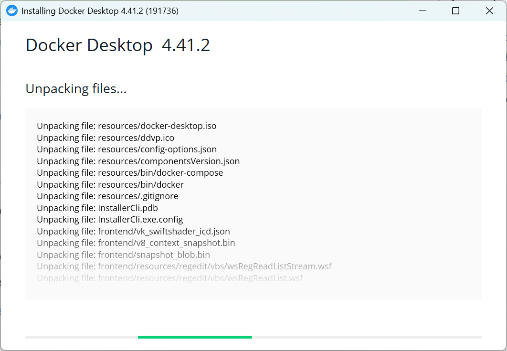
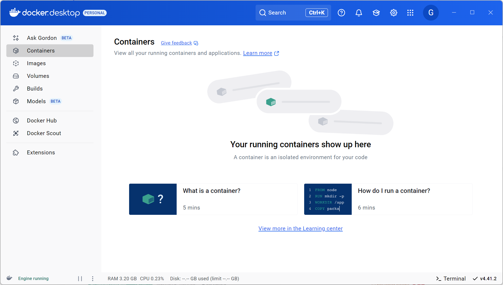
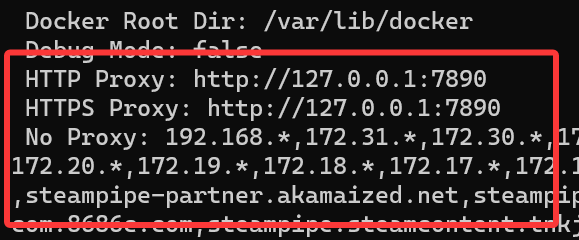
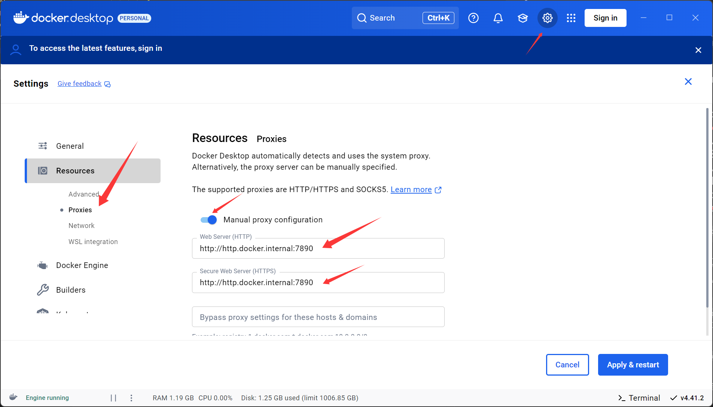
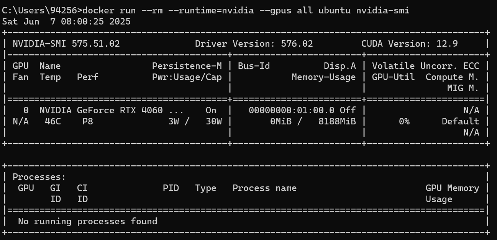
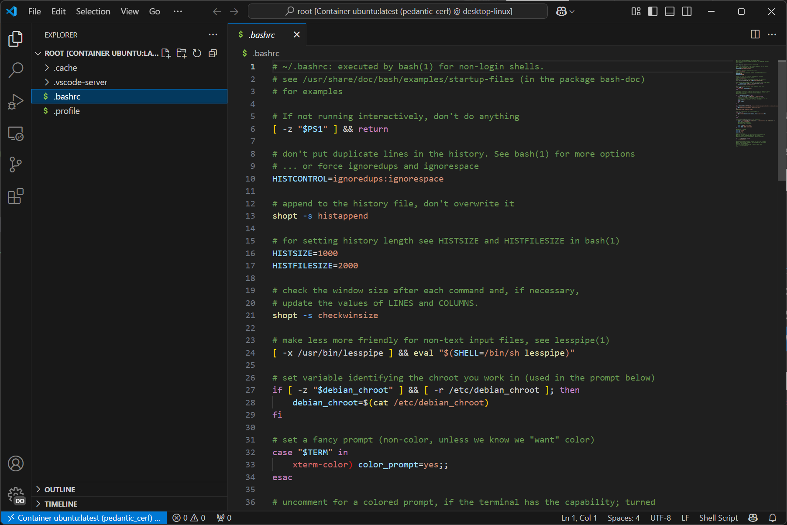

# 1. Docker Installation and Configuration

- [1. Docker Installation and Configuration](#1-docker-installation-and-configuration)
  - [1.1. Windows](#11-windows)
    - [1.1.1. Check WSL](#111-check-wsl)
    - [1.1.2. Install](#112-install)
    - [1.1.3. Open Docker Desktop](#113-open-docker-desktop)
    - [1.1.4. Network Issues](#114-network-issues)
    - [1.1.5. GPU Settings](#115-gpu-settings)
  - [1.2. Ubuntu](#12-ubuntu)
    - [1.2.1. Uninstall Docker Engine](#121-uninstall-docker-engine)
    - [1.2.2. Install](#122-install)
    - [1.2.3. (optional) Manage Docker as a non-root user](#123-optional-manage-docker-as-a-non-root-user)
    - [1.2.4. Network Issues](#124-network-issues)
    - [1.2.5. GPU Settings](#125-gpu-settings)
  - [1.3. Vscode Dev](#13-vscode-dev)
    - [1.3.1. Install Vscode](#131-install-vscode)
    - [1.3.2. Install the following extensions](#132-install-the-following-extensions)
    - [1.3.3. Run a container using Docker extension](#133-run-a-container-using-docker-extension)
    - [1.3.4. Attach vscode](#134-attach-vscode)
  - [1.4. 总结](#14-总结)

## 1.1. Windows

### 1.1.1. Check WSL

控制面板 -> 程序 -> 启用或关闭Windows功能, 勾选以下两项, 随后**重启电脑**以生效


### 1.1.2. Install 

安装Windows版本的[Docker Desktop](https://www.docker.com/)



### 1.1.3. Open Docker Desktop



### 1.1.4. Network Issues

**首先试试什么都不改**, 运行:

```bash
docker run -it ubuntu bash
```

这是一个大约100MB的镜像, 简单测试下网速, 如果不行再尝试后续方法

- **以上是交互式运行docker, 启动bash即终端, 顺便说一下常用的指令:**

    ```bash
    # 显示docker相关信息
    docker info

    # 显示所有容器
    docker ps -a

    # 显示所有镜像
    docker images

    # 删除容器
    docker rm <CONTAINER_ID/NAME>

    # 删除镜像
    docker rmi <IMAGE_ID/NAME>

    # 一般流程
    ## 后台启动容器并运行终端
    docker run -itd <IMAGE_ID/NAME> bash

    ## 启动单独一个进程运行终端, ctrl-D退出, 不会导致容器停止
    docker exec -it <CONTAINER_ID/NAME> bash
    ```

- **(Option 1)**: 更改为国内镜像源 (不推荐, 很多镜像源都失效了, 需要重新找, 例如通过这个[知乎帖子](https://zhuanlan.zhihu.com/p/24461370776)或这个[列表](https://gist.github.com/y0ngb1n/7e8f16af3242c7815e7ca2f0833d3ea6))

    

    增加如下内容: 

    ```json
    {
        "registry-mirrors": [
        "https://docker.xuanyuan.me"
        ]
    }
    ```

    点击`Apply & restart`, 然后使用`docker info`应该能看到镜像源地址

- **(Option 2)**: 修改代理 (需要科学上网, 目前有bug)

    - **一句话总结: 确认wsl settings中的网络模式为`Nat`, 开启VPN即可 (docker会自己走系统代理), 以下是在`Mirrored`模式下的踩坑步骤:**

    1. 直接开启VPN, docker会读取环境变量(例如HTTP_PROXY等), 此时`docker info`看到代理地址变成环境变量所指定的:

        

        但运行`docker run hello-world`却报出`connection refused`

        

        观察到不开VPN时的代理地址为`http.docker.internal:3128`, 因此猜测docker不能访问localhost, 而是通过以上IP, 于是将端口号手动改为代理的端口后尝试:

        

        然而发现手动模式居然没办法覆盖以上代理, 即`http.docker.internal:7890`会被强制设为`http.docker.internal:3128`......

    2. 在github issue上看到最近有同样的问题: [#14666](https://github.com/docker/for-win/issues/14666), [#14706](https://github.com/docker/for-win/issues/14706), 好像是个bug, 解决方法是将wsl的网络设置为`Nat`而非`Mirrored`, 然后就能走系统代理了......

        1. 开始菜单搜索`wsl setting`

        2. 将网络模式设置为`Nat`

            

        3. 重启: `wsl --shutdown`, 然后重新启动docker

        4. `docker info`显示的仍是`http.docker.internal:3128`, 但在VPN的日志里确实看到使用到代理了

        5. 这时候如果要使用wsl, 则里面的proxy要设为host的局域网IP而非localhost, 同时VPN要允许局域网连接

    3. 实测通过`2.`设置后, 打开的容器内部也走代理, 前面踩坑有点白忙活: 只需要确认`Nat`模式 (这个当初还是我为了方便自己改成`Mirrored`的), 直接开代理就好

### 1.1.5. GPU Settings

1.  首先安装[英伟达显卡驱动](https://www.nvidia.com/en-us/drivers/)

2.  用以下指令启动docker容器

    ```bash
    # --rm即运行完指令即刻删除容器, 免去清理容器的步骤
    # --gpus all即会使用到host上的GPU
    docker run --rm --gpus all ubuntu nvidia-smi
    ```

    即可看到显卡信息

    

3. 再试试torch能不能用到cuda, 拉一个[pytorch gpu的docker](https://hub.docker.com/r/pytorch/pytorch/tags?name=cuda)

    ```bash
    docker pull pytorch/pytorch:2.7.1-cuda11.8-cudnn9-runtime
    ```

    下载好后, 进入容器

    ```bash
    docker run -it --rm --gpus all pytorch/pytorch:2.7.1-cuda11.8-cudnn9-runtime bash
    ```

    运行`python`后逐行执行:

    ```python
    import torch
    torch.cuda.is_available()     # True
    torch.ones(3, device="cuda")  # tensor([1., 1., 1.], device='cuda:0')
    ```

    没有问题, 现在的Nvidia支持比以前简单很多了, 不需要额外安装什么东西


## 1.2. Ubuntu

### 1.2.1. Uninstall Docker Engine

If you have used docker before, [uninstall it](https://docs.docker.com/engine/install/ubuntu/#uninstall-docker-engine). (recommanded)


### 1.2.2. Install

Install [Docker Engine](https://docs.docker.com/engine/install/ubuntu/#install-using-the-repository), using `apt`.

### 1.2.3. (optional) Manage Docker as a non-root user

Refer to [this](https://docs.docker.com/engine/install/linux-postinstall/).

### 1.2.4. Network Issues 

- Docker的网络问题主要在拉取镜像时和在容器内部运行时, 分别对应的配置文件是`/etc/docker/daemon.json`和`~/.docker/config.json`

- 参考这篇[知乎](https://zhuanlan.zhihu.com/p/413353281)进行配置:

    `/etc/docker/daemon.json`

    ```json
    {
        "proxies": {
            "http-proxy": "http://127.0.0.1:7890",
            "https-proxy": "http://127.0.0.1:7890",
            "no-proxy": "*.test.example.com,.example.org,127.0.0.0/8"
        }
    }
    ```

    `~/.docker/config.json`

    ```json
    {
        "proxies": {
            "default": {
                "httpProxy": "http://127.0.0.1:7890",
                "httpsProxy": "http://127.0.0.1:7890",
                "noProxy": "*.test.example.com,.example.org,127.0.0.0/8"
            }
        }
    }
    ```

    **配置完记得重启docker: `sudo systemctl restart docker`**

### 1.2.5. GPU Settings

1. 通过`apt`方式安装[NVIDIA Container Toolkit](https://docs.nvidia.com/datacenter/cloud-native/container-toolkit/latest/install-guide.html)

2. 重启docker: `sudo systemctl restart docker`

3. 测试: 

    ```bash
    # --rm即运行完指令即刻删除容器, 免去清理容器的步骤
    # --gpus all即会使用到host上的GPU
    docker run --rm --gpus all ubuntu nvidia-smi
    ```

    

## 1.3. Vscode Dev

### 1.3.1. Install Vscode

[Vscode](https://code.visualstudio.com/)

### 1.3.2. Install the following extensions

- Docker

- Dev Containers


### 1.3.3. Run a container using Docker extension


### 1.3.4. Attach vscode




## 1.4. 总结

这篇笔记记录了在`Windows 11`和`Ubuntu`上安装docker并配置网络和GPU的全过程
