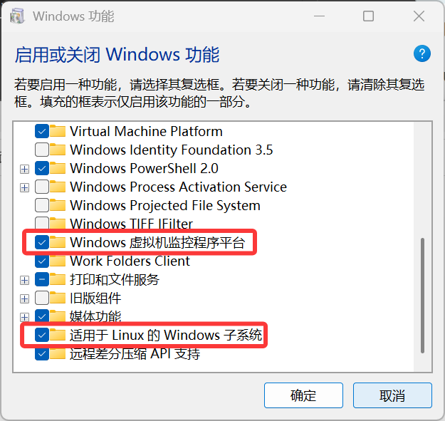
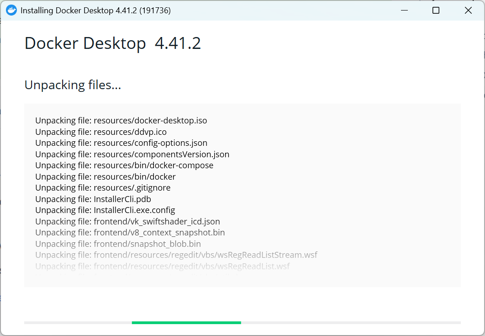
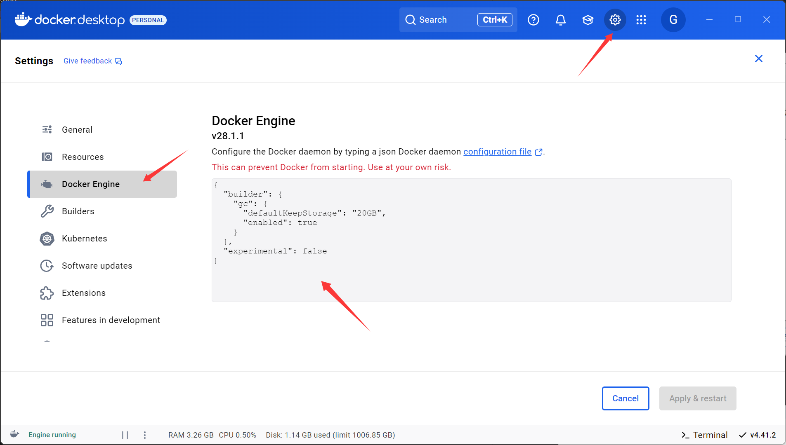
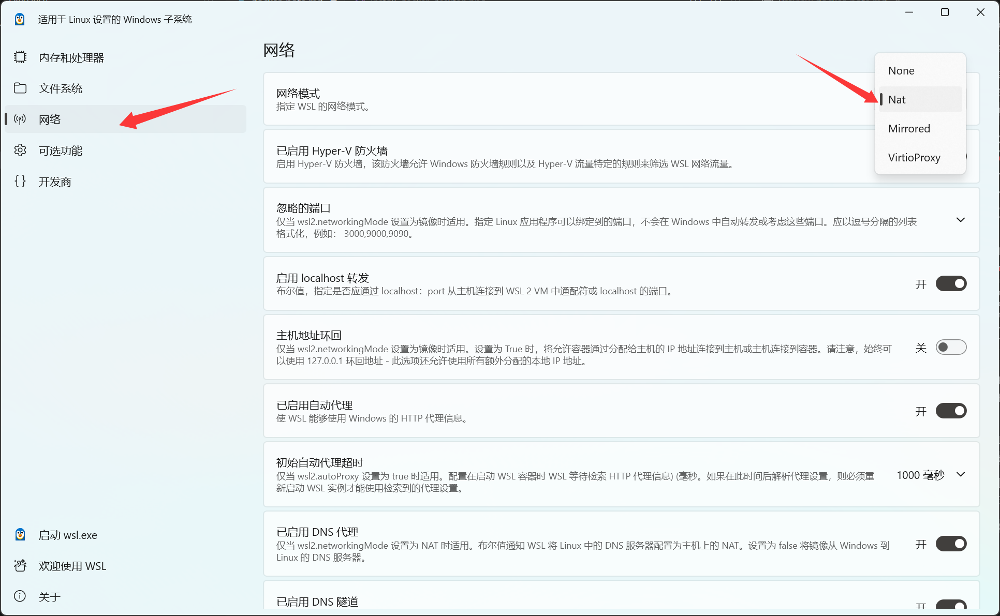
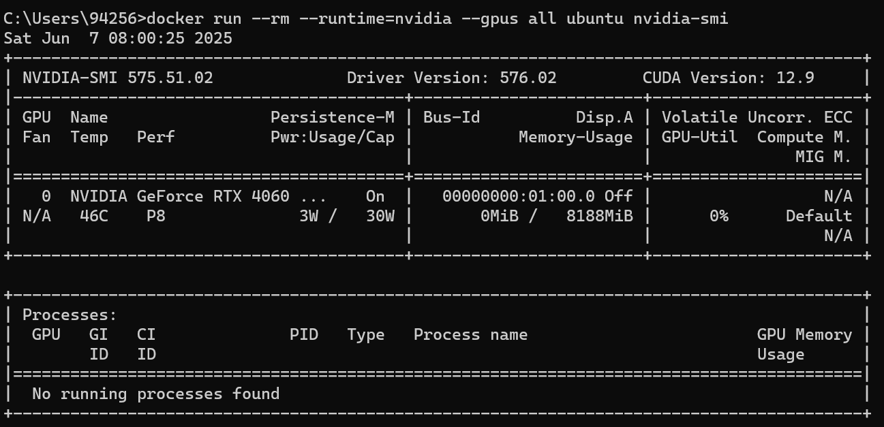

# 1. Docker Installation and Configuration (Quick Start)

**NOTE: Windows 11**

- [1. Docker Installation and Configuration (Quick Start)](#1-docker-installation-and-configuration-quick-start)
    - [1.1. Check WSL](#11-check-wsl)
    - [1.2. Install Docker Desktop](#12-install-docker-desktop)
    - [1.3. Network Issues](#13-network-issues)
    - [1.4. GPU Settings](#14-gpu-settings)

## 1.1. Check WSL

控制面板 -> 程序 -> 启用或关闭Windows功能, 勾选以下两项, 随后**重启电脑**以生效



## 1.2. Install Docker Desktop

安装Windows版本的[Docker Desktop](https://www.docker.com/)



然后运行:


## 1.3. Network Issues

首先运行:

```bash
docker run -it ubuntu bash
```

这是一个大约100MB的镜像, 简单测试下网速. 如果不行, 尝试以下办法:

- **(Option 1)**: 更改为国内镜像源 (不推荐, 很多镜像源都失效了, 需要重新找, 例如通过这个[知乎帖子](https://zhuanlan.zhihu.com/p/24461370776)或这个[列表](https://gist.github.com/y0ngb1n/7e8f16af3242c7815e7ca2f0833d3ea6))

    

    增加如下内容: 

    ```json
    {
        "registry-mirrors": [
        "https://docker.xuanyuan.me"
        ]
    }
    ```

    点击`Apply & restart`, 然后使用`docker info`应该能看到镜像源地址

- **(Option 2)**: 修改代理 (需要科学上网, 目前有bug)

    1. 开始菜单 -> wsl setting -> 网络模式设置为`Nat`

        

    2. 重启: `wsl --shutdown`, 然后重启docker desktop

    3. 打开VPN即可在pull容器、容器内部正常使用代理

## 1.4. GPU Settings


1.  首先安装[英伟达显卡驱动](https://www.nvidia.com/en-us/drivers/)

2.  用以下指令启动docker容器

    ```bash
    # --rm即运行完指令即刻删除容器, 免去清理容器的步骤
    # --gpus all即会使用到host上的GPU
    docker run --rm --gpus all ubuntu nvidia-smi
    ```

    即可看到显卡信息

    

3. 再试试torch能不能用到cuda, 拉一个[pytorch gpu的docker](https://hub.docker.com/r/pytorch/pytorch/tags?name=cuda)

    ```bash
    docker pull pytorch/pytorch:2.7.1-cuda11.8-cudnn9-runtime
    ```

    下载好后, 进入容器

    ```bash
    docker run -it --rm --gpus all pytorch/pytorch:2.7.1-cuda11.8-cudnn9-runtime bash
    ```

    运行`python`后逐行执行:

    ```python
    import torch
    torch.cuda.is_available()     # True
    torch.ones(3, device="cuda")  # tensor([1., 1., 1.], device='cuda:0')
    ```

    没有问题, 现在的Nvidia支持比以前简单很多了, 不需要额外安装什么东西
