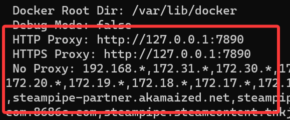
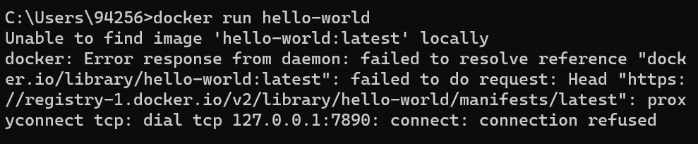

# 1. Docker Installation and Configuration

- [1. Docker Installation and Configuration](#1-docker-installation-and-configuration)
    - [1.1. Windows](#11-windows)
        - [1.1.1. Check WSL](#111-check-wsl)
        - [1.1.2. Install](#112-install)
        - [1.1.3. Open Docker Desktop](#113-open-docker-desktop)
        - [1.1.4. Network Issues](#114-network-issues)
        - [1.1.5. GPU Settings](#115-gpu-settings)
    - [1.2. Ubuntu](#12-ubuntu)

## 1.1. Windows

### 1.1.1. Check WSL

控制面板 -> 程序 -> 启用或关闭Windows功能，勾选以下两项


重启电脑以生效

### 1.1.2. Install 

Install [Docker Desktop](https://www.docker.com/)


### 1.1.3. Open Docker Desktop


### 1.1.4. Network Issues

- **首先试试什么都不改**, 运行:

    ```bash
    docker run -it ubuntu bash
    ```

    这是一个大约100MB的镜像, 简单测试下网速, 如果不行再尝试以下方法

    **以上是交互式运行docker, 启动bash即终端, 顺便说一下常用的指令:**

    ```bash
    # 显示docker相关信息
    docker info

    # 显示所有容器
    docker ps -a

    # 显示所有镜像
    docker images

    # 删除容器
    docker rm <CONTAINER_ID/NAME>

    # 删除镜像
    docker rmi <IMAGE_ID/NAME>

    # 一般流程
    ## 后台启动容器并运行终端
    docker run -itd <IMAGE_ID/NAME> bash

    ## 启动单独一个进程运行终端, ctrl-D退出, 不会导致容器停止
    docker exec -it <CONTAINER_ID/NAME> bash
    ```

- **(Option 1)**: 更改为国内镜像源 (不推荐, 很多镜像源都失效了, 需要重新找, 例如[这个](https://zhuanlan.zhihu.com/p/24461370776))

    

    增加如下内容: 

    ```json
    {
        "registry-mirrors": [
        "https://docker.xuanyuan.me"
        ]
    }
    ```

    点击`Apply & restart`, 然后使用`docker info`应该能看到镜像源地址

- **(Option 2)**: 修改代理(需要科学上网, 目前有bug)

    - **一句话总结: wsl settings确认网络模式为`nat`, 开启VPN即可(docker会自己走系统代理)**, 下面是在`mirrored`模式下的踩坑步骤:

    1. 直接开启代理, docker会读取环境变量($HTTP_PROXY等), 此时`docker info`看到代理地址变成环境变量指定的

        

        但运行`docker run hello-world`却报出`connection refused`

        

        观察到什么都不设置时的代理地址为`http.docker.internal:3128`, 因此猜测docker不能直接访问localhost, 而是通过以上IP, 于是将端口号手动改为代理的端口后尝试

        

        结果发现手动模式没办法覆盖以上代理, 即`http.docker.internal:7890`会被强制设为`http.docker.internal:3128`

    2. 在github issue上看到最近有同样的问题: [#14706](https://github.com/docker/for-win/issues/14706)、[#14666](https://github.com/docker/for-win/issues/14666), 好像是个bug, 解决方法是将wsl的网络设置为`nat`而非`mirrored`, 然后就能走系统代理了...

        1. 开始菜单搜索`wsl setting`

        2. 将网络模式设置为`nat`

            

        3. 重启: `wsl --shutdown`, 然后重新启动docker

        4. `docker info`显示的仍是`http.docker.internal:3128`, 但在VPN日志里确实看到使用到代理了

        5. 但这时候, 如果要使用wsl, 则里面的proxy要设为host的局域网IP而非localhost, 同时VPN要允许局域网连接, 只能说`mirrored`是甜蜜的毒药吧...对docker desktop而言

    3. 实测通过`2.`设置后, 打开的容器内部也走代理, 有点白忙活

### 1.1.5. GPU Settings

1.  首先安装[英伟达显卡驱动](https://www.nvidia.com/en-us/drivers/)

2.  用以下指令启动docker容器

    ```bash
    # --rm即运行完指令即刻删除容器, 免去清理容器的步骤
    # --gpus all即会使用到host上的GPU
    docker run --rm --gpus all ubuntu nvidia-smi
    ```

    即可看到显卡信息

    

3. 再试试torch能不能用到cuda, 拉一个[pytorch gpu的docker](https://hub.docker.com/r/pytorch/pytorch/tags?name=cuda)

    ```bash
    docker pull pytorch/pytorch:2.7.1-cuda11.8-cudnn9-runtime
    ```

    下载好后, 进入容器

    ```bash
    docker run -it --rm --gpus all pytorch/pytorch:2.7.1-cuda11.8-cudnn9-runtime bash

    python
    ```

    逐行执行:

    ```python
    import torch
    torch.cuda.is_available()  # True
    torch.ones(3, device="cuda")  # tensor([1., 1., 1.], device='cuda:0')
    ```

    没有问题, 现在的Nvidia支持比以前简单很多了, 不需要额外安装什么东西


## 1.2. Ubuntu

