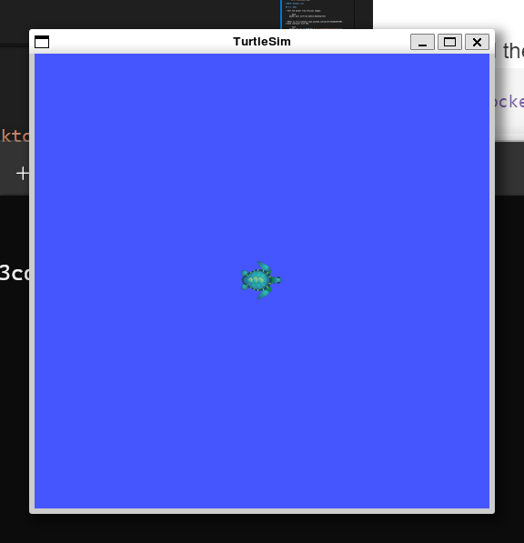
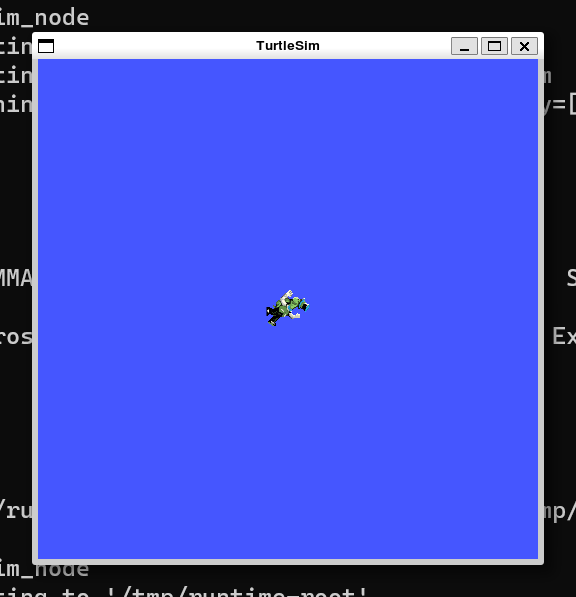

# 3. ROS with GUI using Docker

- [3. ROS with GUI using Docker](#3-ros-with-gui-using-docker)
    - [3.1. ROS1](#31-ros1)
    - [3.2. ROS2](#32-ros2)
- [References](#references)

**NOTE: Windows 11**

## 3.1. ROS1

- Pull the docker from official images:

    ```bash
    docker pull osrf/ros:noetic-desktop-full
    ```

- Refer to [this](https://www.youtube.com/watch?v=ECaBsKY9rUM), create container with GUI:

    ```bash
    docker run -it -e DISPLAY=:0 -v /run/desktop/mnt/host/wslg/.X11-unix:/tmp/.X11-unix -v /run/desktop/mnt/host/wslg:/mnt/wslg osrf/ros:noetic-desktop-full
    ```

    and then run roscore:
    
    ```bash
    $ roscore
    ```

- In new terminal:

    ```bash
    docker ps -a
    docker exec -it <CONTAINER_ID> bash
    
    $ source ros_entrypoint.sh
    $ rosrun turtlesim turtlesim_node
    ```

    


## 3.2. ROS2

- Similar to above:

    ```bash
    docker pull osrf/ros:jazzy-desktop-full

    docker run -it -e DISPLAY=:0 -v /run/desktop/mnt/host/wslg/.X11-unix:/tmp/.X11-unix -v /run/desktop/mnt/host/wslg:/mnt/wslg osrf/ros:jazzy-desktop-full

    # no need to use roscore
    $ ros2 run turtlesim turtlesim_node
    ```

    

# References

- [ROS2 Jazzy | Docker GUI | Windows 11](https://www.youtube.com/watch?v=ECaBsKY9rUM)

- [ROS Docker Document](https://wiki.ros.org/docker)

- [Running ROS2 nodes in Docker](https://docs.ros.org/en/jazzy/How-To-Guides/Run-2-nodes-in-single-or-separate-docker-containers.html)
