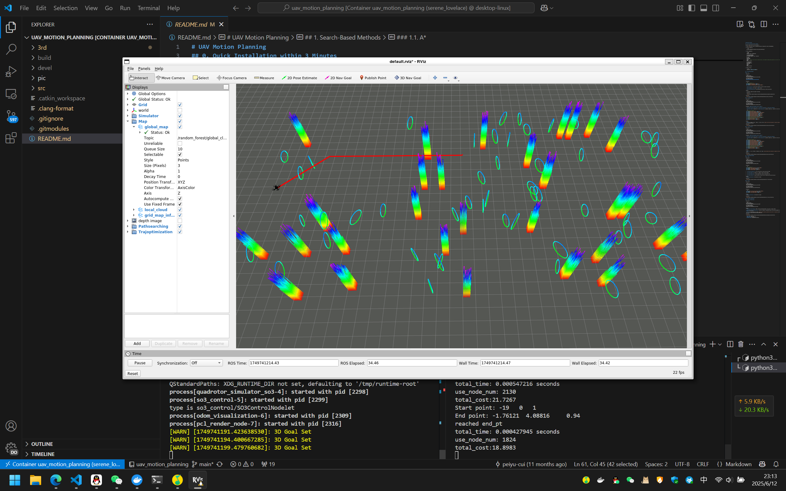

# 4. Use Docker to launch UAV Motion Planning

- [4. Use Docker to launch UAV Motion Planning](#4-use-docker-to-launch-uav-motion-planning)
  - [4.1. Clone the Repository](#41-clone-the-repository)
  - [4.2. Build Docker using Dockerfile](#42-build-docker-using-dockerfile)
  - [4.3. Run Docker Container](#43-run-docker-container)
  - [4.4. Build and Run UAV Motion Planning](#44-build-and-run-uav-motion-planning)

## 4.1. Clone the Repository

Make dir on Windows, e.g, `D:\Workspace`, and then run:

```bash
D:
cd Workspace
git clone git@github.com:peiyu-cui/uav_motion_planning.git
```

## 4.2. Build Docker using Dockerfile

Run:

```bash
cd ./docker
docker build -t uav_motion_planning .
```

image detials refer to [Dockerfile](./docker/Dockerfile).

## 4.3. Run Docker Container

```bash
docker run -itd --rm -e DISPLAY=:0 -v /run/desktop/mnt/host/wslg/.X11-unix:/tmp/.X11-unix -v /run/desktop/mnt/host/wslg:/mnt/wslg -v D:\Workspace:/root/Workspace uav_motion_planning
```

where `-v D:\Workspace:/root/Workspace` mounts the local workspace to the container's workspace.

## 4.4. Build and Run UAV Motion Planning

Connect using vscode, and then refer to [README.md](https://github.com/peiyu-cui/uav_motion_planning/blob/main/README.md).


